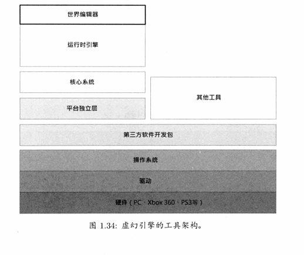

# 第一部分 基础

## 第1章 导论
1. 在开始钻研游戏引擎之前，先简单介绍一下典型游戏团队的人员配置。游戏工作(gamestudio)通常由5个基本专业领域的人员构成，包括工程师(工程师)艺术家(艺术家)游戏设计师(游戏设计师)、制作人(制作人)及其他管理/支持人员(市场策划、法律、信息科技/技术支持、行政等)。

2. 运行时架构图

   

   ```mermaid
   
   graph LR
       A[运行时引擎架构] 
       A --> B[游戏循环]
       A --> C[渲染系统]
       A --> D[物理系统]
       A --> E[音频系统]
       A --> F[输入系统]
       A --> G[资源管理系统]
       A --> H[内存管理]
       A --> I[多线程]
       A --> J[性能监控和调试]
   
       B --> B1[处理输入]
       B --> B2[更新游戏逻辑]
       B --> B3[执行物理计算]
       B --> B4[渲染帧]
       B --> B5[处理音频]
   
       C --> C1[渲染管道]
       C --> C2[着色器]
       C --> C3[缓冲区管理]
   
       D --> D1[碰撞检测]
       D --> D2[刚体动力学]
       D --> D3[流体模拟]
   
       E --> E1[音频文件加载]
       E --> E2[音频解码]
       E --> E3[混音]
       E --> E4[音频输出]
   
       F --> F1[键盘输入]
       F --> F2[鼠标输入]
       F --> F3[手柄输入]
   
       G --> G1[加载资源]
       G --> G2[管理资源]
       G --> G3[释放资源]
   
       H --> H1[内存池]
       H --> H2[对象池]
       H --> H3[自定义分配器]
   
       I --> I1[任务分配]
       I --> I2[多CPU核心]
   
       J --> J1[性能检测]
       J --> J2[内存泄漏检测]
       J --> J3[问题调试]
   
   ```
   
   3. 可用不同方式去构建游戏引擎工具套装。一些工具可能是独立的软件，如图1.32所示。一些工具可能构建在运行时引擎使用的低阶软件层之上，如图1.33所示。一些工具可能嵌入游戏本身。例如，基于Quake和虚幻的游戏都提供游戏内部控制台，供开发者及“modder在游戏运行期间，输入调试和配置命令
   
      
   
      
   
   

## 第2章 专业工具
1. 版本控制

   版本控制系统（Version Control System, VCS）是游戏开发中不可或缺的工具，用于管理代码和资源的变更。常见的版本控制系统包括Git、Subversion（SVN）和Perforce。它们能够记录每次变更，允许开发者回滚到之前的版本，并且支持多人协作开发，解决代码冲突。

2. 微软Visual Studio

   微软Visual Studio是一个功能强大的集成开发环境（IDE），广泛应用于游戏开发中。它提供了丰富的工具集，包括代码编辑器、调试器、性能剖析工具和图形调试工具。Visual Studio支持多种编程语言，如C++、C#等，并且集成了许多插件，极大地提高了开发效率。

3. 剖析工具

   剖析工具（Profiler）用于分析游戏的性能瓶颈和优化代码。通过剖析工具，开发者可以详细了解CPU和GPU的使用情况，找出耗时较多的函数和代码段。常见的剖析工具有Intel VTune、NVIDIA Nsight和AMD CodeXL等。

4. 内存泄漏和损坏检测

   内存管理是游戏开发中的一个重要方面，内存泄漏和内存损坏是常见的问题。为了检测和解决这些问题，开发者使用内存泄漏检测工具（如Valgrind、AddressSanitizer）和内存损坏检测工具（如Electric Fence）。这些工具可以帮助开发者发现并修复内存相关的错误，确保游戏的稳定性和性能。

5. 其他工具

   除了上述主要工具外，还有许多其他工具在游戏开发中发挥重要作用：

   * **图形调试工具**：如RenderDoc、PIX和NVIDIA Nsight，用于调试和优化图形渲染。
   * **构建系统**：如CMake、Make和Ninja，用于自动化构建过程，提高编译效率。
   * **协作工具**：如JIRA、Trello和Slack，用于项目管理和团队沟通。

## 第3章 游戏软件工程基础
### 3.1 重温C++及最佳实践
### 3.2 C/C++的数据、代码及内存
### 3.3 捕捉及处理错误

## 第4章 游戏所需的三维数学
### 4.1 在二维中解决三维问题
### 4.2 点和矢量
### 4.3 矩阵
### 4.4 四元数
### 4.5 比较各种旋转表达方式
### 4.6 其他数学对象
### 4.7 硬件加速的SIMD运算
### 4.8 产生随机数

# 第二部分 低阶引擎系统

## 第5章 游戏支持系统
### 5.1 子系统的启动和终止
### 5.2 内存管理
### 5.3 容器
### 5.4 字符串
### 5.5 引擎配置

## 第6章 资源及文件系统
### 6.1 文件系统
### 6.2 资源管理器

## 第7章 游戏循环及实时模拟
### 7.1 渲染循环
### 7.2 游戏循环
### 7.3 游戏循环的架构风格
### 7.4 抽象时间线
### 7.5 测量及处理时间
### 7.6 多处理器的游戏循环
### 7.7 网络多人游戏循环

## 第8章 人体学接口设备（HID）
### 8.1 各种人体学接口设备
### 8.2 人体学接口设备的接口技术
### 8.3 输入类型
### 8.4 输出类型
### 8.5 游戏引擎的人体学接口设备系统
### 8.6 人体学接口设备使用实践

## 第9章 调试及开发工具
### 9.1 日志及跟踪
### 9.2 调试用的绘图功能
### 9.3 游戏内置菜单
### 9.4 游戏内置主控台
### 9.5 调试用摄像机和游戏暂停
### 9.6 作弊
### 9.7 屏幕截图及录像
### 9.8 游戏内置性能剖析
### 9.9 游戏内置的内存统计和泄漏检测

# 第三部分 图形及动画

## 第10章 渲染引擎
### 10.1 采用深度缓冲的三角形光栅化基础
### 10.2 渲染管道
### 10.3 高级光照及全局光照
### 10.4 视觉效果和覆盖层
### 10.5 延伸阅读

## 第11章 动画系统
### 11.1 角色动画的类型
### 11.2 骨骼
### 11.3 姿势
### 11.4 动画片段
### 11.5 蒙皮及生成矩阵调色板
### 11.6 动画混合
### 11.7 后期处理
### 11.8 压缩技术
### 11.9 动画系统架构
### 11.10 动画管道
### 11.11 动作状态机
### 11.12 动画控制器

## 第12章 碰撞及刚体动力学
### 12.1 你想在游戏中加入物理吗
### 12.2 碰撞/物理中间件
### 12.3 碰撞检测系统
### 12.4 刚体动力学
### 12.5 整合物理引擎至游戏
### 12.6 展望：高级物理功能

# 第四部分 游戏性

## 第13章 游戏性系统简介
### 13.1 剖析游戏世界
### 13.2 实现动态元素：游戏对象
### 13.3 数据驱动游戏引擎
### 13.4 游戏世界编辑器

## 第14章 运行时游戏性基础系统
### 14.1 游戏性基础系统的组件
### 14.2 各种运行时对象模型架构
### 14.3 世界组块的数据格式
### 14.4 游戏世界的加载和串流
### 14.5 对象引用与世界查询
### 14.6 实时更新游戏对象
### 14.7 事件与消息泵
### 14.8 脚本
### 14.9 高层次的游戏流程

# 第五部分 总结

## 第15章 还有更多内容吗
### 15.1 一些未谈及的引擎系统
### 15.2 游戏性系统