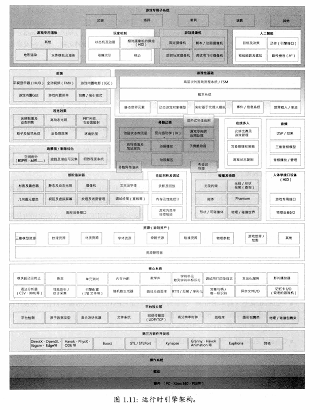
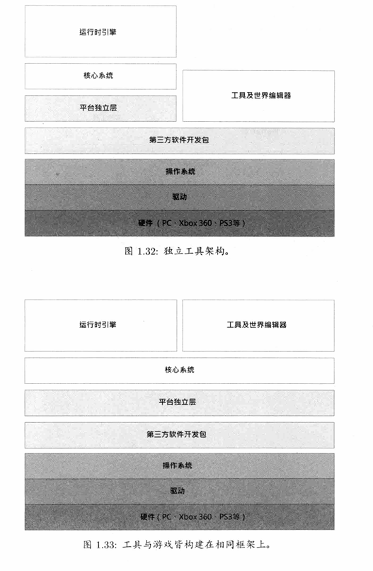
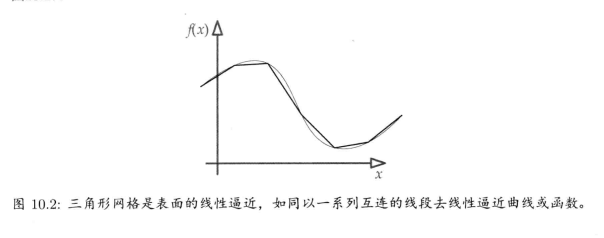
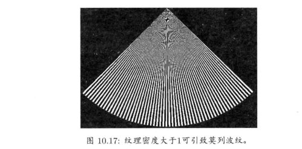

# 第一部分 基础

## 第1章 导论
1. 在开始钻研游戏引擎之前，先简单介绍一下典型游戏团队的人员配置。游戏工作(gamestudio)通常由5个基本专业领域的人员构成，包括工程师(工程师)艺术家(艺术家)游戏设计师(游戏设计师)、制作人(制作人)及其他管理/支持人员(市场策划、法律、信息科技/技术支持、行政等)。

2. 运行时架构图

   

   ```mermaid
   
   graph LR
       A[运行时引擎架构] 
       A --> B[游戏循环]
       A --> C[渲染系统]
       A --> D[物理系统]
       A --> E[音频系统]
       A --> F[输入系统]
       A --> G[资源管理系统]
       A --> H[内存管理]
       A --> I[多线程]
       A --> J[性能监控和调试]
   
       B --> B1[处理输入]
       B --> B2[更新游戏逻辑]
       B --> B3[执行物理计算]
       B --> B4[渲染帧]
       B --> B5[处理音频]
   
       C --> C1[渲染管道]
       C --> C2[着色器]
       C --> C3[缓冲区管理]
   
       D --> D1[碰撞检测]
       D --> D2[刚体动力学]
       D --> D3[流体模拟]
   
       E --> E1[音频文件加载]
       E --> E2[音频解码]
       E --> E3[混音]
       E --> E4[音频输出]
   
       F --> F1[键盘输入]
       F --> F2[鼠标输入]
       F --> F3[手柄输入]
   
       G --> G1[加载资源]
       G --> G2[管理资源]
       G --> G3[释放资源]
   
       H --> H1[内存池]
       H --> H2[对象池]
       H --> H3[自定义分配器]
   
       I --> I1[任务分配]
       I --> I2[多CPU核心]
   
       J --> J1[性能检测]
       J --> J2[内存泄漏检测]
       J --> J3[问题调试]
   
   ```
   
   3. 可用不同方式去构建游戏引擎工具套装。一些工具可能是独立的软件，如图1.32所示。一些工具可能构建在运行时引擎使用的低阶软件层之上，如图1.33所示。一些工具可能嵌入游戏本身。例如，基于Quake和虚幻的游戏都提供游戏内部控制台，供开发者及“modder在游戏运行期间，输入调试和配置命令
   
      
   
      
   
   

## 第2章 专业工具
1. 版本控制

   版本控制系统（Version Control System, VCS）是游戏开发中不可或缺的工具，用于管理代码和资源的变更。常见的版本控制系统包括Git、Subversion（SVN）和Perforce。它们能够记录每次变更，允许开发者回滚到之前的版本，并且支持多人协作开发，解决代码冲突。

2. 微软Visual Studio

   微软Visual Studio是一个功能强大的集成开发环境（IDE），广泛应用于游戏开发中。它提供了丰富的工具集，包括代码编辑器、调试器、性能剖析工具和图形调试工具。Visual Studio支持多种编程语言，如C++、C#等，并且集成了许多插件，极大地提高了开发效率。

3. 剖析工具

   剖析工具（Profiler）用于分析游戏的性能瓶颈和优化代码。通过剖析工具，开发者可以详细了解CPU和GPU的使用情况，找出耗时较多的函数和代码段。常见的剖析工具有Intel VTune、NVIDIA Nsight和AMD CodeXL等。

4. 内存泄漏和损坏检测

   内存管理是游戏开发中的一个重要方面，内存泄漏和内存损坏是常见的问题。为了检测和解决这些问题，开发者使用内存泄漏检测工具（如Valgrind、AddressSanitizer）和内存损坏检测工具（如Electric Fence）。这些工具可以帮助开发者发现并修复内存相关的错误，确保游戏的稳定性和性能。

5. 其他工具

   除了上述主要工具外，还有许多其他工具在游戏开发中发挥重要作用：

   * **图形调试工具**：如RenderDoc、PIX和NVIDIA Nsight，用于调试和优化图形渲染。
   * **构建系统**：如CMake、Make和Ninja，用于自动化构建过程，提高编译效率。
   * **协作工具**：如JIRA、Trello和Slack，用于项目管理和团队沟通。

## 第3章 游戏软件工程基础
1. 重温C++及最佳实践

   本节回顾了C++语言的关键特性和最佳实践，强调了在游戏开发中高效和安全地使用C++的重要性。包括面向对象编程、模板编程、智能指针的使用以及避免常见的编程错误。还介绍了一些提高代码性能和可维护性的技巧，如使用内联函数和避免不必要的对象复制。

2. C/C++的数据、代码及内存

   本节深入探讨了C/C++中的数据类型、代码组织和内存管理。包括堆栈和堆内存的区别、如何有效地分配和释放内存、以及如何使用内存池来优化内存管理。还讨论了常见的内存问题，如内存泄漏和缓冲区溢出，并提供了避免这些问题的方法。

3. 捕捉及处理错误

   本节介绍了在游戏开发中如何捕捉和处理错误的方法。包括使用断言（assert）进行调试、异常处理机制（try-catch）、日志记录和错误报告系统。强调了及时发现和修复错误对游戏开发的重要性，并提供了最佳实践来提高代码的鲁棒性和可靠性。

## 第4章 游戏所需的三维数学
1. 在二维中解决三维问题

   本节讨论了如何在二维平面上处理三维问题的技巧，包括将复杂的三维问题简化为易于处理的二维问题。通过这种方法，可以大大降低计算复杂度，提高引擎的性能和效率。

2. 点和矢量

   点和矢量是游戏引擎中最基本的数学对象。点通常表示空间中的位置，而矢量则表示方向和距离。理解点和矢量的基本操作（如加减、点积和叉积）是构建复杂几何运算的基础。

3. 矩阵

   矩阵在游戏引擎中用于执行几何变换，如平移、旋转和缩放。通过矩阵，可以方便地将物体从一个坐标系转换到另一个坐标系。掌握矩阵的基本操作和变换矩阵的构造方法对于三维图形编程非常重要。

4. 四元数

   四元数是一种表示旋转的数学工具，具有避免万向节锁死问题的优势。四元数的插值（如球形线性插值）在平滑过渡和动画中广泛应用。本节详细介绍了四元数的基本概念、操作和优点。

5. 比较各种旋转表达方式

   本节比较了不同的旋转表示方法，包括欧拉角、旋转矩阵和四元数。每种方法都有其优点和缺点，选择合适的旋转表示方法可以根据具体应用需求来决定。

6. 其他数学对象

   除了点、矢量、矩阵和四元数外，还有一些其他常用的数学对象，如平面、射线和包围体（如轴对齐包围盒AABB和包围球）。这些对象在碰撞检测、视锥体裁剪和物体包围等方面有重要应用。

7. 硬件加速的SIMD运算

   单指令多数据（SIMD）运算利用硬件并行处理能力，可以显著提高数学运算的性能。本节介绍了如何利用SIMD指令集（如Intel的SSE和AVX）来优化引擎中的数学计算。

   Unity引擎的DOST(**多线程式数据导向型技术堆栈**)系统就是以他为基础做的技术升级

8. 产生随机数

   随机数在游戏中有广泛的应用，如生成程序化内容、模拟随机事件和实现随机动画。本节讨论了不同的随机数生成算法及其应用场景，并介绍了如何使用现代编程语言中的随机数库。

# 第二部分 低阶引擎系统

## 第5章 游戏支持系统
1. 子系统的启动和终止

   - **启动顺序**：介绍了不同子系统启动的顺序和依赖关系，确保在启动过程中没有未初始化的依赖。

   - **终止顺序**：说明了各子系统关闭的顺序，以确保所有资源都能正确释放，防止资源泄漏。

   - **启动和终止的过程**：讨论了如何实现子系统的启动和终止过程，包括初始化和销毁函数的设计。

2. 内存管理

   - **内存分配策略**：详细讨论了各种内存分配策略，如堆分配器、栈分配器和池分配器。

   - **内存碎片问题**：解释了内存碎片的成因及其对性能的影响，并提供了解决方案。

   - **内存管理工具**：介绍了一些内存管理工具和技术，用于检测和调试内存问题，如内存泄漏和内存越界。

3. 容器

   - **容器类型**：介绍了游戏引擎中常用的容器类型，包括动态数组、链表、哈希表和树结构。

   - **性能和内存使用**：讨论了不同容器在性能和内存使用方面的优缺点，帮助开发者选择合适的容器。

   - **容器的实现**：提供了自定义容器类的设计和实现建议，强调了代码的高效性和可维护性。

4. 字符串

   - **字符串存储**：讨论了字符串的存储方式，如C风格字符串和C++标准库的字符串类。

   - **字符串操作**：介绍了常用的字符串操作和优化技术，如字符串连接、搜索和替换。

   - **自定义字符串类**：提供了自定义字符串类的设计示例，展示了如何优化字符串处理以提高性能。

5. 引擎配置

   - **配置文件格式**：讨论了常用的配置文件格式，如XML、JSON和自定义格式。

   - **配置解析**：介绍了配置文件的解析方法和工具，强调了易用性和可扩展性。

   - **引擎参数调整**：探讨了通过配置系统调整引擎参数的机制，使得引擎可以灵活适应不同的需求和环境。

## 第6章 资源及文件系统
1. 文件系统

   - **文件抽象层**：介绍了文件抽象层的设计，使得引擎可以在不同的操作系统和平台上使用统一的文件操作接口。这一层的主要作用是屏蔽底层文件系统的差异，为上层系统提供一致的文件操作API。

   - **虚拟文件系统**：讨论了虚拟文件系统（VFS）的概念，它允许将不同来源的文件（如本地硬盘、压缩包、网络）统一映射到一个虚拟文件系统中。这样可以简化文件访问逻辑，提高系统的灵活性和扩展性。

   - **文件路径处理**：强调了路径规范化和路径解析的重要性，以确保文件访问的一致性和正确性。这包括处理相对路径和绝对路径、路径合并和路径分解等操作。

   - **文件I/O性能**：介绍了提高文件输入输出性能的技术和方法，包括异步I/O、内存映射文件和文件缓存等。这些技术旨在减少I/O操作的延迟，提高文件访问效率。

2. 资源管理器

   - **资源的加载与卸载**：讨论了资源加载和卸载的策略，介绍了资源引用计数和生命周期管理的方法，以优化内存使用和提高性能。资源管理器需要有效地管理内存，防止资源泄漏和冗余加载。

   - **资源打包与流式传输**：说明了资源打包技术和流式传输的概念，帮助在需要时即时加载资源，减少加载时间。打包技术可以减少磁盘碎片和I/O操作次数，流式传输则允许大文件按需加载，提高资源加载效率。

   - **资源格式**：探讨了各种资源格式的选择和转换，强调了资源的可移植性和高效性。资源格式的选择会影响到资源的加载速度、内存占用和跨平台兼容性。

   - **资源管理工具**：介绍了一些常用的资源管理工具和技术，用于资源的打包、管理和优化。有效的工具和技术可以帮助开发者更好地组织和处理大量的游戏资源，提高开发效率。

## 第7章 游戏循环及实时模拟
1. 渲染循环

   - **定义**：渲染循环是指在每一帧中更新和绘制游戏场景的过程。

   - **主要步骤**：包括清除屏幕、绘制游戏对象、处理后期效果以及呈现最终图像。

   - **目标**：保持高帧率和一致的用户体验。

2. 游戏循环

   - **定义**：游戏循环是整个游戏运行过程中不断重复的逻辑，主要负责处理输入、更新游戏状态和渲染画面。

   - **主要组成**：包括处理用户输入、更新游戏逻辑、检测碰撞和物理模拟、更新AI以及渲染图形。

   - **重要性**：游戏循环是游戏引擎的核心，它决定了游戏的响应速度和整体性能。

3. 游戏循环的架构风格

   - **单线程循环**：所有的游戏逻辑和渲染在同一个线程中进行，简单但可能导致性能瓶颈。

   - **多线程循环**：将游戏逻辑和渲染分配到不同的线程中，以提高性能和响应速度。

   - **架构选择**：根据游戏的复杂性和平台性能来选择适合的游戏循环架构。

4. 抽象时间线

   - **时间管理**：处理游戏中的时间，包括游戏时间、实际时间和逻辑时间。

   - **时间步长**：决定每帧的时间间隔，确保游戏逻辑和物理模拟的稳定性。

   - **帧率独立性**：实现帧率独立的游戏逻辑，使游戏在不同的帧率下都能正常运行。

5. 测量及处理时间

   - **时间测量工具**：介绍了用于测量和管理时间的工具和技术，如高分辨率计时器和性能计数器。

   - **时间优化**：讨论了如何优化时间处理，以提高游戏的整体性能和响应速度。

6. 多处理器的游戏循环

   - **多核处理**：利用多核处理器分担游戏循环中的计算任务，提高性能。

   - **任务分配**：将不同的游戏任务分配到不同的处理器核心上，优化资源利用。

   - **同步和并行**：处理多线程编程中的同步和并行问题，确保游戏逻辑的一致性。

7. 网络多人游戏循环

   - **网络同步**：讨论了如何在网络环境中同步游戏状态，保证各客户端的一致性。

   - **延迟和抖动**：处理网络延迟和抖动对游戏体验的影响，提供流畅的多人游戏体验。

   - **架构设计**：介绍了常见的网络游戏架构，如客户端-服务器模式和对等网络模式。

## 第8章 人体学接口设备（HID）
1. 各种人体学接口设备

   - **输入设备**：包括键盘、鼠标、游戏手柄、触摸屏和动作捕捉设备等。这些设备用于向游戏引擎传递用户输入。

   - **输出设备**：主要指显示器、扬声器和振动反馈装置，用于向用户传递游戏信息和反馈。

2. 人体学接口设备的接口技术

   - **接口标准**：如USB、蓝牙和专用无线协议。这些标准定义了设备与主机之间的通信方式。

   - **驱动程序**：设备需要特定的驱动程序来与操作系统和游戏引擎进行通信。驱动程序的稳定性和性能直接影响设备的使用体验。

3. 输入类型

   - **离散输入**：如按键按下或松开事件。适用于键盘和按钮等设备。

   - **模拟输入**：如摇杆和触摸板的连续位置数据。适用于需要精细控制的设备。

   - **手势输入**：如触摸屏上的滑动、缩放和旋转手势。这种输入方式越来越流行，尤其是在移动设备上。

4. 输出类型

   - **视觉输出**：通过显示器呈现图形界面和游戏画面。包括2D和3D图像的渲染。

   - **音频输出**：通过扬声器或耳机播放声音效果和背景音乐。音频输出在增强游戏沉浸感方面起到重要作用。

   - **触觉反馈**：通过振动和力反馈装置提供触觉响应。这种反馈可以增加游戏的现实感和互动性。

5. 游戏引擎的人体学接口设备系统

   - **抽象层**：为不同的HID提供统一的接口，简化设备管理和数据处理。

   - **事件处理**：管理来自各种输入设备的事件，并将其转换为游戏逻辑可以理解的命令。

   - **设备配置**：允许玩家自定义设备设置和控制映射，提高游戏的可操作性和个性化体验。

6. 人体学接口设备使用实践

   - **设计原则**：如简洁、直观和响应迅速。这些原则有助于提高设备的可用性和用户体验。

   - **测试和优化**：确保设备在不同平台和环境下的稳定性和性能。包括对延迟、灵敏度和兼容性的测试。

## 第9章 调试及开发工具
1. 日志及跟踪

   - **日志系统**：用于记录游戏运行时的各种信息，如错误、警告和调试信息。

   - **跟踪系统**：用于跟踪特定事件的发生和执行过程，有助于定位问题。

2. 调试用的绘图功能

   - **调试绘图**：在游戏运行时通过绘图功能可视化内部数据和状态，如物理碰撞盒、路径规划等。

   - **用途**：帮助开发者理解和调整游戏逻辑和物理模拟。

3. 游戏内置菜单

   - **调试菜单**：在游戏中集成的菜单系统，允许开发者实时修改参数和触发特定事件。

   - **优势**：提高调试效率，方便进行各种测试。

4. 游戏内置主控台

   - **控制台**：提供一个命令行界面，允许开发者输入命令和查看输出。

   - **功能**：执行调试命令、查看变量值和状态信息。

5. 调试用摄像机和游戏暂停

   - **调试摄像机**：自由控制摄像机视角，以便观察游戏场景的不同部分。

   - **游戏暂停**：在调试时暂停游戏运行，方便检查和调整游戏状态。

6. 作弊

   - **定义**：在调试过程中使用的特殊命令或功能，允许开发者跳过某些流程或直接设置游戏状态。

   - **常见作弊**：无敌模式、跳关、直接获得资源等。

7. 屏幕截图及录像

   - **截图**：捕捉游戏中的图像，方便问题报告和测试记录。

   - **录像**：录制游戏运行过程，用于回放和分析。

8. 游戏内置性能剖析

   - **性能剖析工具**：用于分析游戏性能，找出瓶颈和性能问题。

   - **功能**：实时显示CPU、GPU使用率和内存占用等关键性能指标。

9. 游戏内置的内存统计和泄漏检测

   - **内存统计**：记录和显示游戏运行时的内存使用情况。

   - **泄漏检测**：检测内存泄漏，确保内存资源的正确释放。

# 第三部分 图形及动画

## 第10章 渲染引擎
1. 采用深度缓冲的三角形光栅化基础

   - 传统来说，游戏开发者会使用三角形网格来为表面建模。三角形是表面的分段线性逼近(piecewise linear approximation)，如同用多条相连的线段分段逼近一个函数或曲线(见图10.2)。

     

     在各种多边形中，实时渲染之所以选用三角形，是因为三角形有以下的优点。

     + 三角形是最简单的多边形。少于3个顶点就不能成为一个表面。
     + 三角形必然是平坦的。含4个或以上顶点的多边形不一定是平坦的，因为其前3个顶点能定义一个平面，第4个顶点或许会位于该平面之上或之下。
     + 三角形经多种转换之后仍然维持是三角形，这对于仿射转换和透视转换也成立。最坏的情况下，从三角形的边去观看，三角形会退化为线段。在其他角度观察，仍能维持是三角形。几乎所有商用图形加速硬件都是为三角形光栅化而设计的。从最早期的PC三维图形加速器开始，渲染硬件一直几乎只专注为三角形光栅化而设计。此决策还可追溯至最早期使用软件光栅化的三维游戏，如《德军师令部》和《毁灭战士》。无论个人喜恶，基于三角形的技术已牢牢确立在游戏业界，在未来几年应该还不会有大转变。

   - **压缩纹理**  此处不详述其细节，但其基本原理是把纹理切割成多个2像素x2像素的小块，并使用一个小型调色板(color palette)储存每个小块的颜色。显然，压缩纹理的优点是比无压缩纹理使用较少内存。其额外的好处，或许读者想不到。事实上，使用压缩纹理渲染也较高效。S3TC纹理能够提速，皆因其内存存取模式更缓存友好--每个小块把2x2个相邻像素储存至单个64或128位字，因此能够更充分利用缓存，

   - **纹素密度及多级渐远纹理**
     想象我们要渲染一个满屏的四边形(两个三角形组成的长方形)，此四边形还贴上一张纹理，其尺寸刚好配合屏幕的分辨率。在这种情况下，每个纹素刚好对应一个屏幕像素，我们称其纹素密度(texel density，即纹素和像素之比)为1。当在较远距离观看该四边形时，其屏幕上的面积就会变小。由于纹理的尺寸不变，该四边形的纹素密度就会大于1，即每个像素会受多于一个纹素所影响。
     显然纹素密度并不是一个常量，它会随物体相对摄像机的距离而改变。纹素密度影响内存使用量，也影响三维场景的视觉品质。当纹素密度远低于1，每个纹素就会显著比屏幕像素大，那么就会开始察觉到纹素的边缘。这会毁灭游戏的真实感。当纹素密度远高于1，许多纹素会影响单个屏幕像素。这样会产生如图10.17所示的莫列波纹(moiré bandingpattern)。更甚者，由于像素边缘内的多个纹素会按细微的摄像机移动而不断改变像素的颜色，像素的颜色就会显得浮动不定及闪烁。而且，若玩家永不会接近一些远距离的物体，用非常高的纹素密度渲染那些物体只是浪费内存。

     

   * 当渲染纹理三角形上的像素时，图形硬件会计算像素中心落入纹理空间的位置，来对纹理贴图采样。通常纹素和像素之间并没有一对一的映射，像素中心可以落入纹理空间的任何位置，包括在两个或以上纹素之间的边缘。因此，图形硬件通常需要采样出多于一个纹素，并把采样结果混合以得出实际的采样纹素颜色。此过程称为纹理过滤(texture filtering)多数显卡支持以下的纹理过滤种类。
     1. 最近邻(nearest neighbor):这种粗糙方法会挑选最接近像素中心的纹素。当使用多级渐远纹理时，此方法会挑选一个渐远纹理级数，该级数最接近但高于理想的分辨率。理想分辨率是指达到屏幕空间纹素密度为1。
     2. 双线性(bilinear):此方法会对围绕像素中心的4个纹素采样，并计算该4个颜色的加权平均(权重是基于纹素和像素中心的距离)。当使用多级渐远纹理时，也是选择最接近的级数。
     3. 三线性(trilinear):此方法把双线性过滤法施于最接近的两个渐远纹理级数(一个高于理想分辨率，一个低于理想分辨率)，然后把两个采样结果线性插值。这样便能消除屏幕上碍眼的、相邻渐远纹理级数之间的边界。
     4. **各向异性(anisotropic)**:双线性和三线性过滤都是对2x2的纹素块采样。如果纹理表面是刚好面对着摄像机的，这样是正确的做法。然而，若表面倾斜于虚拟屏幕平面，这就不太正确了。各向异性过滤法会根据视角，对一个梯形范围内的纹理采样，借以提高非正对屏幕的纹理表面的视觉品质。

   - **深度缓冲区**：用于存储每个像素的深度信息，解决了图像渲染中的遮挡问题。
   - **光栅化**：将三角形转换为像素，并根据深度信息进行绘制，以生成最终图像。

2. 渲染管道

   - **固定功能管道**：传统的渲染方式，依赖于硬件的固定功能。

   - **可编程管道**：现代渲染技术，允许开发者使用着色器语言编写顶点和片段着色器，提供更大的灵活性和控制力。

3. 高级光照及全局光照

   - **高级光照技术**：如光线追踪（Ray Tracing）和辐射度（Radiosity），用于模拟真实光照效果。

   - **全局光照**：考虑了环境光和间接光照，使得场景更加逼真。

4. 视觉效果和覆盖层

   - **后处理效果**：包括景深、运动模糊、色调映射等，用于增强图像质量和视觉效果。

   - **覆盖层**：在渲染过程中添加的图形元素，如UI、HUD（抬头显示器）等。

5. 延伸阅读
   - **推荐书目和资源**：提供了进一步深入学习渲染技术和图形编程的书籍和文章。

## 第11章 动画系统
### 11.1 角色动画的类型
### 11.2 骨骼
### 11.3 姿势
### 11.4 动画片段
### 11.5 蒙皮及生成矩阵调色板
### 11.6 动画混合
### 11.7 后期处理
### 11.8 压缩技术
### 11.9 动画系统架构
### 11.10 动画管道
### 11.11 动作状态机
### 11.12 动画控制器

## 第12章 碰撞及刚体动力学
### 12.1 你想在游戏中加入物理吗
### 12.2 碰撞/物理中间件
### 12.3 碰撞检测系统
### 12.4 刚体动力学
### 12.5 整合物理引擎至游戏
### 12.6 展望：高级物理功能

# 第四部分 游戏性

## 第13章 游戏性系统简介
### 13.1 剖析游戏世界
### 13.2 实现动态元素：游戏对象
### 13.3 数据驱动游戏引擎
### 13.4 游戏世界编辑器

## 第14章 运行时游戏性基础系统
### 14.1 游戏性基础系统的组件
### 14.2 各种运行时对象模型架构
### 14.3 世界组块的数据格式
### 14.4 游戏世界的加载和串流
### 14.5 对象引用与世界查询
### 14.6 实时更新游戏对象
### 14.7 事件与消息泵
### 14.8 脚本
### 14.9 高层次的游戏流程

# 第五部分 总结

## 第15章 还有更多内容吗
### 15.1 一些未谈及的引擎系统
### 15.2 游戏性系统