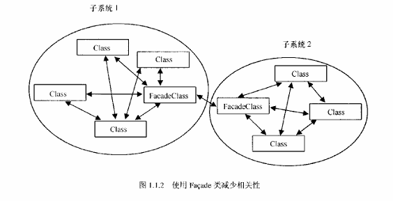

# 第1章  通用编程技术

## 1.0  神奇的数据驱动设计 

1. 不要硬编码，常量尽量做成配置文件

## 1.1  面向对象的编程与设计技术 

1. 很多文章和书籍都对通用的面向对象设计实践给出了很好的建议，但我印象中很少有针对游戏编程实践的。游戏程序员与典型的应用程序员有些不同。由于游戏程序员总是工作在最前沿的，要把人类和使件的限制推到极限，因而他们往往更愿意改变其至打破传统的程序设计原则。不幸的是,这种倾向常常会由于对共本OOP原则理解或实现的不当而产生负面效应，产生不可维护的代码。

2. Façade设计模式：

   

   ​															**↓**

   

## 1.2  使用模板元编程的快速数学方法 

1. 模板元编程允许在编译期进行计算，从而减少运行时的开销。例如，编译期的常量表达式计算和类型推导可以显著提升程序的运行效率。

## 1.3  一种自动的Singleton工具 

## 1.4  在游戏编程中使用STL 

## 1.5  一个通用的函数绑定接口 

## 1.6  通用的基于句柄的资源管理器  

## 1.7  资源和内存管理  

## 1.8  快速数据载入技巧  

## 1.9  基于帧的内存分配  

## 1.10  简单快速的位数组  

## 1.11  在线游戏的网络协议  

## 1.12  最大限度地利用Assert  

## 1.13  Stats：实时统计和游戏内调试 

## 1.14  实时的游戏内建剖析 

# 第2章　数学技巧

## 2.0  可预测随机数  

## 2.1  插值方法  

## 2.2  求刚体运动方程的积分  

## 2.3  三角函数的多项式逼近  

## 2.4  为数字稳定性而利用隐式欧拉积分  

## 2.5  小波：理论与压缩 

## 2.6  水面的交互式模拟  

## 2.7  游戏编程四元数 

## 2.8  矩阵和四元数之间的转换 

## 2.9  四元数插值 

## 2.10  最短弧四元数 

# 第3章　人工智能

## 3.0  设计一个通用、健壮的AI引擎  

## 3.1  一个有限状态机类 

## 3.2  博弈树

## 3.3  A*路径规划基  

## 3.4  A*审美优化 

## 3.5  A*速度优化 

## 3.6  简化的3D运动和使用导航网格进行寻径 

## 3.7  Flocking：一种模拟群体行为的简单技术 

## 3.8  用于视频游戏的模糊逻辑 

## 3.9  神经网络初探 

# 第4章　多边形技术

## 4.0  为OpenGL优化顶点提交 

## 4.1  调整顶点的投影深度值  

## 4.2  矢量摄像机 

## 4.3  摄像机控制技术

## 4.4  一种快速的圆柱棱台相交测试算法 

## 4.5  3D碰撞检测 

## 4.6  用于交互检测的多分辨率地图 

## 4.7  计算到区域内部的距离 

## 4.8  对象阻塞剔除 

## 4.9  永远不要让他们看到你的“抖动”——几何体细节层次选择问题 

## 4.10  八叉树构造 

## 4.11  松散的八叉树 

## 4.12  独立于观察的渐进网格 

## 4.13  插值的3D关键帧动画 

## 4.14  一种快速而简单的皮肤构造技术 

## 4.15  填充间隙——使用缝合和皮肤构造的高级动画 

## 4.16  实时真实地形生成  

## 4.17  不规则地形生成——断层构造  

## 4.18  不规则地形生成——中点置换  

## 4.19  不规则地形生成——粒子沉积  

# 第5章　像素特效

## 5.0  2D镜头光晕  

## 5.1  将3D硬件用于2D子画面特效  

## 5.2  基于运动的静态光照  

## 5.3  使用定点颜色插值模拟实时光照  

## 5.4  衰减图  

## 5.5  使用纹理坐标生成技术的高级纹理  

## 5.6  硬件凹凸贴图  

## 5.7  底面阴影  

## 5.8  复杂对象上的实时阴影 

## 5.9  使用光滑预过滤和Fresnel项改善环境映射反射 

## 5.10  游戏中玻璃的效果 

## 5.11  用于容器中液体的折射贴图 

