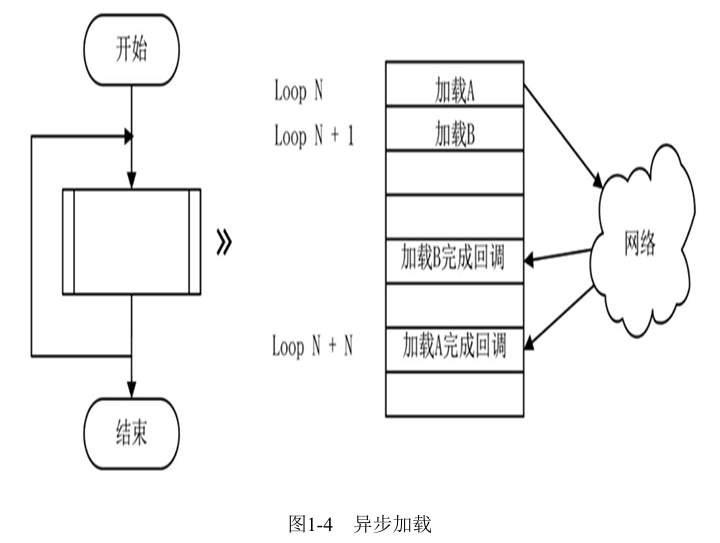
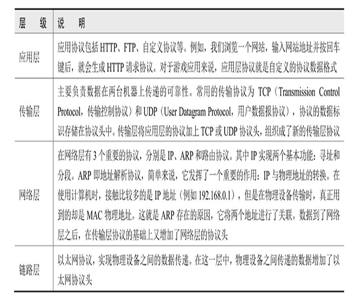
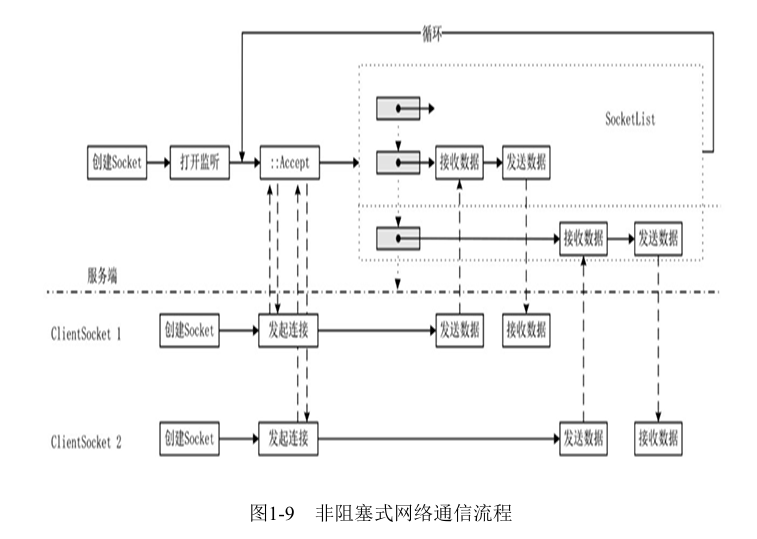

# 第1章 网络编程基础

## 1.1 单机游戏与网络游戏的区别

1. 第一个需要了解的概念是“异步”。与“异步”一起出现的概念有“同 步”“并行”（并发）等，这几个概念往往比较容易混淆。 举一个加载的例子，如果需要加载几个不同的资源，先加载A，等到A加载 完成后再加载B，加载完B，再加载C，直到所有资源加载完成，这就是同步操 作。以同步方式实现加载，加载者必须等到加载完成之后才能继续后续的加 载。 如果用3个线程同时加载A、B、C资源，由于线程之间是不会相互影响的， 加载A的同时另外两个线程在加载B和C，这就是并行操作。但这种情况不能算是 异步，因为在加载A时，要等待A加载完成之后退出线程。这个等待产生了阻 塞。 那么，什么是异步呢？异步不会等待，也不会阻塞。 假设加载一个资源需要10秒，加载3个资源，在串行时需要30秒，在并行时 需要10秒，异步也需要10秒。

2. 那么，异步与并行的差别在哪里呢?以图1-4为例来看一下异步的流程。在第N帧发出了加载A命令，这一帧会马 上结束，不需要等待10秒，直接进入下一帧，不关心A是否加载成功，当它加载 成功之后，会在某一帧收到加载成功的回调。因为是异步，同时加载A、B时， 得到结果的顺序可能是不一样的，可能A先发出加载命令，但是B的回调却先发生

   

3. 那么，程序是如何知道回调完成的呢？一般来说，有两种方式可以知道A是 否加载成功：
   1.  主动询问，每间隔一段时间询问A是否加载完成。
   2. 被动接收，一般在启动事件时会要求注册一个回调函数，事件完成时 会主动调用回调函数，以标记事件完成。
4.  所谓异步，简而言之，就是在不阻塞进程的情况下完成操作。

## 1.2 理解IP地址

1. 我们看到的IP地址通常是4个十进制数，以“.”隔开，每个十进制数不超 过255。

## 1.3 理解TCP/IP

1. 理论上，开放系统互连参考模型（Open System Interconnection Reference Model，OSI参考模型）为7层。TCP/IP并不完全匹配这7层，它有4层 协议

2. 图1-6简洁地说明了TCP/IP四层协议中的基本结构。链路层囊括网络层的数 据，而网络层又囊括传输层的数据。像洋葱一样，数据发送时一层一层被包裹 起来，到了发送目的地，像剥洋葱一样，又一层一层剥离，最终得到应用层需 要的数据。在这个过程中，首先需要理解“层”的概念，表1-1详细说明了每个 协议层级的作用。

   

   

3. 从应用与操作系统的层面来看协议在这几 个层级的处理。发送数据时，如图1-7所示，数据从左侧自上而下叠加，而到了 目标主机，数据是自下而上剥离的，最终到了应用层面，就变成了当初发送的 数据。

   

## 1.4 阻塞式网络编程

1. 对于：：recv函数而言，buf是接收数据的缓存，len是该缓存的长度。假 设服务端向客户端发送了2024字节的数据，但客户端接收buf的长度只有1024， len的长度也只能为1024，即：：recv函数一次只会读取系统底层网络缓冲中的 1024字节，放入buf缓冲中。这个概念非常关键，会引发粘包、拆包的问题。网 络数据并不是我们想象中一条一条规整地发送过来的，有可能接收的1024字节 里面有3个协议数据，也有可能接收的1024字节只是某个协议的一部分，需要多 次读取。
2. 函数：：accept、：：send和：：recv都处于 阻塞模式下。 所谓阻塞，就是一定要收到数据之后，后面的操作才会继续。客户端调 用：：connect函数连接到服务端，发送数据之后一直阻塞在：：recv函数 上，直到收到服务端传来的数据才退出。服务端同样是阻塞的，在：：accept 函数处等待连接进来，如果没有就一直等待，接收到一个连接之后，再次阻 塞，等待：：recv函数返回数据
3. 作为服务端，采用阻塞模式显然不够高效。一般来说，服务端需要同时处 理成千上万个通信，不能因为一个连接而阻塞另一个连接的收发数据进程。在 实际情况下，更常用的是非阻塞模式。

## 1.5 非阻塞网络编程

## 1.6 总结

# 第2章 网络IO多路复用

## 2.1 Select网络模型

1. 让系统底层去判断Socket是处于可读 还是可写状态，在可读可写时通知上层，也就是我们常用的网络IO处理——IO 多路复用。
2. Select是一个在Windows和Linux系统下通用的模型。该模型名为Select主 要是因为它以名为：：select的函数为驱动，该函数以不同的返回值来决定后 续如何操作。简单来说，其主要的原理就是监视描述符（Socket）的变化来进 行读写操作，且在必要时抛出异常。
3. 实Select模式原理就是将关心的Socket放到读、写或异常集合中，再传递给：： select函数，它会帮助我们分析、筛选并返回有事件的Socket集合。一旦有了 返回值，再判断每个Socket处于哪一个集合中，针对不同的集合有不同的操 作。如果Socket处于读集合，那么进行读操作；如果Socket处于写集合，那么 进行写操作；如果发生异常，就可以断开网络
4. select函数的连接数量是有限制的，在Linux系统 中，将robots测试工程中的线程调为1100就会发现产生错误提示，这是因为 Linux默认支持集合的最大值为1024
5. Select模型是一种主动的查询模式，这种模式有上限的局限性，而且每一 帧都需要把所有关心的Socket压入集合中，这也带来了效率问题。

## 2.2 Epoll网络模型

1. Select模型兼容两种系统，但Epoll只能在Linux系统下运行。相对于 Select，Epoll最大的好处在于它不会因为连接数量过多而降低效率。在前面 的示例中，我们可以发现Select采用了轮询的方式，假如有3000个连接，在每 一帧都要将3000个Socket放到集合中进行轮询。而Epoll正好相反，Epoll对需 要监听的事件进行注册，对于读事件，只需要注册一次，而不是每一帧盲目地 轮询。
2. select函数每一帧中都对所有Socket进行注册，但 是Epoll不需要那么频繁操作，只需要修改一次，底层就会一直保持其监听事件，直到上层逻辑对其监听的事件做出修改

# 第3章 线程、进程以及Actor模型

## 3.1 游戏架构概述

1. 无服务端游戏除了单机游戏之外，还有一种无服务端游戏架构——P2P架构

2. 单进程CS架构

3. 多进程CS架构

## 3.2 框架瓶颈

1. 滚服游戏:可以认为是一种平行空间的游戏方式，因为一 个游戏世界容纳不了太多人，过一段时间就新开一个服务器，每个服务器的世 界都一样。因为不断地增加新的服务器，用“滚服”来形容非常贴切。这类游戏技术的实现较为简单，只需要多开服务端，用简单的单进程CS架 构就可以实现。但它有一个缺点，玩家承载是有限的；合服是滚服游戏一定要考虑的问题，一开始就要考虑的问题是合服时的数 据库处理。

2. 副本游戏:在副本游戏中，会为玩家专门开辟一个地图或空间实 例。例如棋牌，为每一桌可以开一个副本空间

3.  大图分割空间游戏:大图分割空间游戏。将一张大图分割成几个处理块，或者将不同地 图放到不同进程进行处理。这类游戏又分为两种类型：一种类型如《剑侠情缘 网络版叁》，不同的城镇在服务端可能在不同的进程中；另一种类型如《魔兽 世界》，采用了Big World（大地图）的方式，所有的人看似都在同一个地图 上，但其实这个地图像农田一样被划分成了多个小块，每个小块由不同的地图 实例管理；分割一张地图有一个比较难处理的问题，玩家移动的时候，如果正好处于分割 空间的分界线上，就会产生边界问题

## 3.3 设计游戏框架

## 3.4 游戏主循环

## 3.5 理解进程和线程

### 3.5.1 进程是什么

### 3.5.2 线程是什么

### 3.5.3 C++标准线程库

## 3.6 Actor模型

## 3.7 游戏框架中的线程

### 3.7.1 包裹类ThreadObject

### 3.7.2 线程类Thread

### 3.7.3 线程管理类ThreadMgr

### 3.7.4 libserver库与游戏逻辑

## 3.8 Actor对象之间的消息处理机制

### 3.8.1 消息定义原则

### 3.8.2 消息队列机制

## 3.9 总结

# 第4章 账号登录与验证

## 4.1 登录流程图

## 4.2 制作一个简单的验证接口

### 4.2.1 Nginx参考配置

### 4.2.2 php-fpm参考配置

## 4.3 导入PHP登录接口

### 4.3.1 修改PHP中的数据库配置

### 4.3.2 导入测试账号

### 4.3.3 批量生成账号

## 4.4 编码中用到的第三方库

### 4.4.1 库libcurl

### 4.4.2 库libjsoncpp

## 4.5 账号验证代码分析

### 4.5.1 定义登录协议号

### 4.5.2 处理协议的Account类

### 4.5.3 Account类如何放置到线程中

### 4.5.4 处理验证的HttpRequestAccount类

## 4.6 结果测试

## 4.7 消息过滤机制

## 4.8 测试机器人

### 4.8.1 状态机

### 4.8.2 状态机基类

### 4.8.3 状态机管理类

### 4.8.4 Robot类中的状态机

## 4.9 批量登录测试

## 4.10 总结

# 第5章 性能优化与对象池

## 5.1 Visual Studio性能工具

## 5.2 内存中的数据结构

### 5.2.1 交换型数据结构

### 5.2.2 刷新型数据结构

## 5.3 gprof

### 5.3.1 gprof调用堆栈图

### 5.3.2 让进程安全退出

### 5.3.3 用gprof工具查看框架

## 5.4 valgrind

## 5.5 对象池

### 5.5.1 对象池代码分析

### 5.5.2 使用cmd命令查看对象池

## 5.6 总结

# 第6章 搭建ECS框架

## 6.1 一个简单的ECS工程

### 6.1.1 组件类Component

### 6.1.2 实体类Entity

### 6.1.3 系统类System

### 6.1.4 管理类EntitySystem

### 6.1.5 测试

## 6.2 基于ECS框架的libserver

### 6.2.1 通过字符串动态创建类

### 6.2.2 提供多参变量来创建实例

### 6.2.3 EntitySystem的工作原理

## 6.3 基于ECS框架的login和robots工程

### 6.3.1 Account类

### 6.3.2 动态创建组件或实例

### 6.3.3 ECS框架下的网络通信

### 6.3.4 执行效率

## 6.4 YAML文件

### 6.4.1 YAML编译安装

### 6.4.2 读取YAML配置文件

### 6.4.3 合并线程

## 6.5 log4cplus日志

### 6.5.1 log4cplus的编译安装

### 6.5.2 配置文件

### 6.5.3 使用log4cplus

## 6.6 总结

# 第7章 MySQL数据库

## 7.1 MySQL Connector/C

## 7.2 连接时使用的函数说明

## 7.3 数据库连接组件

### 7.3.1 MysqlConnector组件

### 7.3.2 连接数据库

### 7.3.3 关闭连接

## 7.4 写入数据时使用的函数说明

## 7.5 写入数据示例

### 7.5.1 创建预处理

### 7.5.2 用预处理创建角色

## 7.6 查询数据时使用的函数说明

## 7.7 查询数据示例

### 7.7.1 Query查询函数

### 7.7.2 查询玩家数据

## 7.8 数据表的创建与更新

### 7.8.1 创建表

### 7.8.2 更新表

### 7.8.3 测试更新与创建组件

## 7.9 数据表中的数据结构与protobuf结构

## 7.10 角色查询与创建流程

### 7.10.1 为login进程与dbmgr进程创建连接类

### 7.10.2 找到指定的NetworkConnector实例

### 7.10.3 创建角色

### 7.10.4 机器人登录创建角色测试

## 7.11 总结

# 第8章 深入学习组件式编程

## 8.1 新的系统管理类SystemManager

### 8.1.1 实体系统EntitySystem

### 8.1.2 更新系统UpdateSystem

### 8.1.3 消息系统MessageSystem

### 8.1.4 测试执行效率

## 8.2 allinone工程

### 8.2.1 新工程allinone

### 8.2.2 协议是如何被转发的

### 8.2.3 查看线程中的所有对象

### 8.2.4 测试执行效率

## 8.3 线程分类

## 8.4 IAwakeSystem接口与对象池

### 8.4.1 DynamicObjectPoolCollector对象池集合

### 8.4.2 全局单例对象

### 8.4.3 查看线程中的所有对象

## 8.5 主动销毁对象

### 8.5.1 一般组件销毁

### 8.5.2 引用计数销毁对象

## 8.6 时间堆

### 8.6.1 堆实现代码

### 8.6.2 时间堆组件

## 8.7 总结

# 第9章 服务器管理进程与HTTP

## 9.1 启动多个login进程

## 9.2 appmgr进程

## 9.3 HTTP

## 9.4 使用Mongoose分析HTTP格式

### 9.4.1 HTTP类型

### 9.4.2 接收HTTP数据

### 9.4.3 处理HTTP数据的协议号

### 9.4.4 收到HTTP请求是如何响应的

### 9.4.5 发送HTTP返回数据流程

## 9.5 为Packet定义新的网络标识

### 9.5.1 使用网络标识创建一个连接

### 9.5.2 使用网络标识发送数据

### 9.5.3 向外部请求HTTP数据

## 9.6 HTTP分块

## 9.7 机器人测试批量登录

## 9.8 总结

# 第10章 分布式登录与Redis内存数据库

## 10.1 game与space的定位

### 10.1.1 选择合适的game进程

### 10.1.2 使用token登录game进程

### 10.1.3 Player组件

## 10.2 Redis及其第三方库

### 10.2.1 Redis的安装

### 10.2.2 Redis命令行命令

### 10.2.3 hireids库

### 10.2.4 组件RedisConnector

### 10.2.5 Redis在login中的应用

### 10.2.6 Redis在game中的应用

### 10.2.7 从Redis删除数据

## 10.3 性能瓶颈分析

### 10.3.1 使用日志查看瓶颈

### 10.3.2 优化MessageComponent组件

### 10.3.3 ConnectObj内存组织

## 10.4 多进程登录协议回顾

## 10.5 总结

# 第11章 分布式跳转方案

## 11.1 资源数据配置与读取

### 11.1.1 资源管理类ResourceManager

### 11.1.2 地图资源管理类ResourceWorldMgr

### 11.1.3 地图资源类ResourceWorld

## 11.2 地图类World与代理类WorldProxy

### 11.2.1 地图类World

### 11.2.2 为什么需要WorldProxy

## 11.3 分布式地图跳转流程

### 11.3.1 发起跳转协议的时机

### 11.3.2 跳转协议的数据定义

### 11.3.3 目标代理地图收到跳转协议

### 11.3.4 网络标识如何在网络中传递

### 11.3.5 space进程发送的协议如何转发到客户端

## 11.4 通过客户端进入游戏

## 11.5 玩家在WorldProxy之间的跳转

## 11.6 总结

# 第12章 断线与动态加载系统

## 12.1 玩家断线

### 12.1.1 玩家在login进程中断线

### 12.1.2 玩家在game进程中断线

### 12.1.3 玩家断线时World类的处理

### 12.1.4 玩家数据的读取与保存

### 12.1.5 如何进入断线之前的地图

## 12.2 进程之间的断线

### 12.2.1 login进程断线与重连

### 12.2.2 game进程断线与重连

### 12.2.3 space进程断线与重连

### 12.2.4 appmgr进程断线与重连

## 12.3 动态新增系统

### 12.3.1 MoveComponent组件

### 12.3.2 新系统MoveSystem

### 12.3.3 加载新系统

### 12.3.4 测试移动

## 12.4 总结

# 写在最后——如何构建自己的框架

# 附录A 在CentOS上建立开发环境
